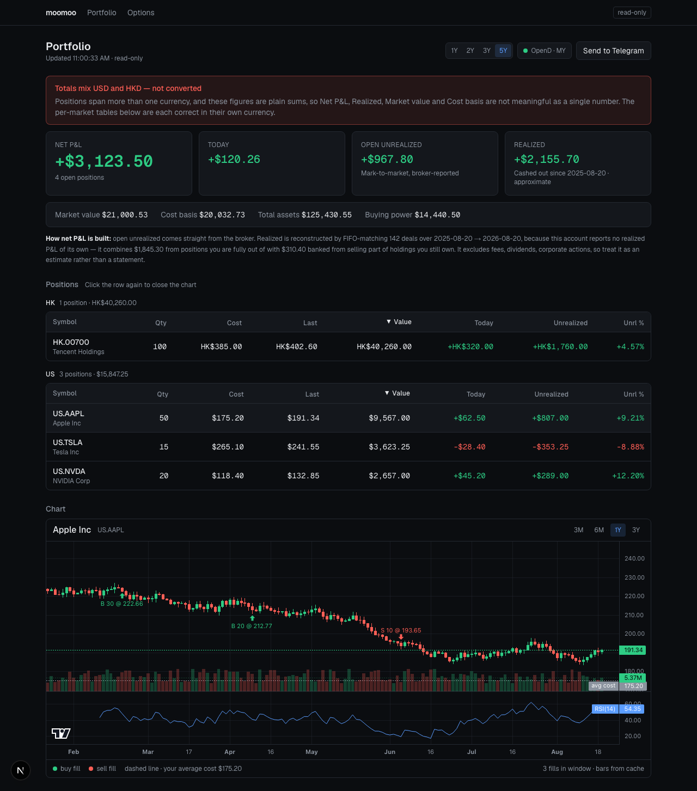
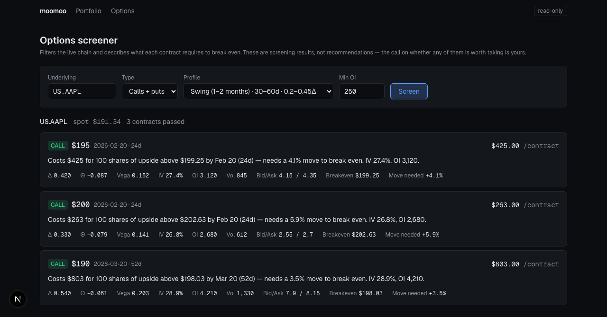

# moomoo-app

Read-only moomoo portfolio dashboard, options screener, and Telegram alerts —
running entirely on localhost.

```
Claude Code ──(moomoo Agent Hub skills)──┐
                                         ▼
Next.js 16  ──HTTP──>  Python sidecar  ──TCP──>  OpenD (127.0.0.1:11111)  ──>  moomoo
localhost:3000         localhost:8788            holds your logged-in session
```

## Screenshots

Fake data — no real account, symbols, or balances. See `docs/screenshots/`.

**Portfolio dashboard** — P&L summary with provenance, positions grouped by
market, price chart with fill markers:



**Options screener** — mechanical per-contract characterisation, no ranking:



## Why a Python sidecar and not the Node SDK

The npm `moomoo-api` package depends on `protobufjs@6`, which carries several
unpatched critical advisories with no fix available. The Python SDK is the
officially supported path, is what moomoo's own Agent Hub skill drives, and
means Claude and this dashboard share one integration instead of two.

## Read-only by construction

There is no order-placing endpoint anywhere in this codebase. `sidecar/
moomoo_client.py` runs an `assert_read_only()` check at import time that
crashes the process if `place_order`, `modify_order` or `unlock_trade` ever
appear in it, and the Next.js proxy uses an explicit route allowlist. Placing
trades stays in the moomoo app, where it belongs.

## Prerequisites

- **Node.js 20.9+** and npm
- **Python 3.10+** with `venv` (3.13 is what this was built and tested on)
- **A moomoo account** with OpenD access (see step 1)
- macOS or Linux — `start-dev.sh` / `run-sidecar.sh` are bash scripts; on
  Windows use WSL

## Setup

### 1. Install OpenD

OpenD is the gateway that holds your brokerage session. Download it from
<https://www.moomoo.com/download/OpenAPI> → **Moomoo OpenD** → Mac. Version
must be **10.10.7008 or newer** to match the pinned SDK.

Install it, launch it, and log in with your moomoo credentials. In OpenD's
settings confirm:

- **Listening address**: `127.0.0.1` (not `0.0.0.0`)
- **Port**: `11111`

Keep it on `127.0.0.1`. moomoo requires a private key for trading interfaces
on any non-local address, which is their way of saying an exposed OpenD is a
live trading endpoint on the open internet.

### 2. Configure

```bash
npm install
npm run setup:sidecar   # creates sidecar/.venv and installs its requirements
cp .env.example .env
```

Start the sidecar, then discover your real account settings:

```bash
npm run sidecar
```

```bash
curl -s localhost:8788/accounts | python3 -m json.tool
```

Set `MOOMOO_SECURITY_FIRM` and `MOOMOO_TRD_MARKET` in `.env` to match what
that returns. This must reflect the moomoo entity your account was opened
under — `FUTUMY` for moomoo Malaysia, `FUTUINC` for moomoo US, and so on.
A mismatch returns an empty account list rather than an error.

### 3. Telegram (optional)

1. Message [@BotFather](https://t.me/BotFather), send `/newbot`, copy the token.
2. Send your new bot any message.
3. Open `https://api.telegram.org/bot<TOKEN>/getUpdates` and copy
   `result[0].message.chat.id`.
4. Put both in `.env`, restart the sidecar, then:

```bash
curl -X POST localhost:8788/notify/test
```

### 4. Run

One command starts both the website and the sidecar:

```bash
npm run dev
```

Then open <http://localhost:3000>. (`npm run dev:web` and `npm run sidecar`
still run them separately if you want split logs.)

## Alerts

The scheduler runs inside the sidecar. Configure in `.env`:

| Variable | Meaning |
|---|---|
| `ALERT_DAILY_TIME` | Time of the daily summary, local, `HH:MM` |
| `ALERT_DAYS` | `mon-fri`, `daily`, or a list like `mon,wed,fri` |
| `ALERT_MOVE_ABS` | Message when net P&L moves this much since the last alert, in `MOOMOO_CURRENCY`. `0` disables |
| `ALERT_CHECK_MINUTES` | How often the move check runs |
| `ALERTS_ENABLED` | `false` to silence everything |
| `ALERT_SCREEN_ENABLED` | Daily options screen digest |
| `ALERT_SCREEN_TIME` | When the digest sends |
| `ALERT_SCREEN_CODES` | Blank derives from your positions |

The screen digest sends the same per-strike mechanical lines the UI shows —
cost, breakeven, required move, IV, liquidity. It reports what each contract
is and what it needs to do; it does not rank contracts by desirability or
suggest what to buy. Symbols in markets with no option entitlement are skipped
rather than reported as errors.

**Alerts only fire while the sidecar is running on this Mac.** Nothing fires
when the machine is off or asleep — there is no cloud component, by design.
`local.moomoo-app.sidecar.plist` will auto-start the sidecar at login so you
do not have to start it by hand, but a sleeping Mac still sends nothing. It's
a template — edit the `WorkingDirectory` and script path inside it to match
where you cloned this repo before loading it with `launchctl`.

## How net P&L is assembled

moomoo does not report a single net P&L for securities accounts —
`accinfo_query` only carries realized/unrealized for *futures* accounts. So it
is built from three sources of differing authority:

| Component | Source | Authority |
|---|---|---|
| Open unrealized | `position_list_query.unrealized_pl` | Broker-reported |
| Banked on open | `position_list_query.realized_pl` | Broker-reported |
| Closed realized | FIFO match over `history_deal_list_query` | **Derived, approximate** |

Fully-closed positions vanish from the position list, so their P&L is
reconstructed by FIFO-matching executed deals (long and short inventory
tracked separately, options multiplied by contract size). It excludes
commissions, dividends and corporate actions, and is only as complete as the
history window queried. The UI labels it as approximate — don't reconcile
your taxes against it.

### Currencies are converted before they are summed

The account settles US positions in USD and Bursa positions in MYR. Figures are
bucketed by settlement currency, converted into `MOOMOO_CURRENCY`, then summed —
so the dashboard shows one comparable total. Deal rows carry no `currency`
field, but they carry `deal_market`, and the market determines the currency;
without that a Bursa round-trip lands in the dollar total untouched.

`/pnl` returns the converted totals at the top level, the unconverted
per-currency figures under `by_currency`, and a `conversion` block naming the
rate used.

**Where the rate comes from.** OpenD serves no forex quotes — the `FX` market
answers `Unsupported quote market` and the account carries no entitlement for
it. But `accinfo_query` converts the *whole account* into whatever currency it
is asked for, so asking twice and dividing the two `total_assets` gives
moomoo's own live conversion rate exactly:

```
rate(MYR→USD) = total_assets(in USD) / total_assets(in MYR)
```

That is `MoomooClient.fx_rates()`. It works for any currency the SDK supports
(`USD HKD CNH JPY SGD AUD CAD MYR NZD`), including ones the account holds
nothing in, and it keeps the dashboard reconciled with moomoo's own figures.
Sanity check: the same method returns 7.8399 for HKD, inside the peg band.

Rates are cached for 60s — `accinfo_query` shares the 10-calls-per-30s budget
with the dashboard's polling, and FX does not move fast enough for the
staleness to matter.

Two caveats travel with it:

- **Fallback.** If the live read fails, `account_breakdown()` recovers the rate
  from a single payload as `(total_assets - <base>_assets) / <foreign>_assets`.
  That only works when exactly one foreign currency holds a balance. A currency
  neither source can price is listed in `conversion.unconverted` and left
  **out** of the totals rather than added at face value.
- **Realized P&L uses today's rate**, not the rate on the trade date. The broker
  reports no historical rates, so a MYR gain banked months ago is restated in
  today's dollars and drifts with the currency.

`/account` also attaches a `currency_split` with the untouched per-currency
balances and the fallback rate.

## Options screener

`get_option_chain` returns only static contract terms; greeks, IV and open
interest can be *filtered* server-side but are not returned. The screener
therefore does chain → codes → `get_market_snapshot` → merge.

Each result carries a one-line characterisation built purely from live
numbers — what the contract costs, where it breaks even, what move that
implies, its IV and liquidity. It describes mechanics; it does not recommend.
Whether any of it is worth trading is your call.

## Using it from Claude

There are two Claude clients and they read **different config files**:

| Client | Config | Paths |
|---|---|---|
| Claude Code (in this folder) | `.mcp.json` (committed) | relative — it runs here |
| Claude Desktop app | `~/Library/Application Support/Claude/claude_desktop_config.json` | **absolute** — it does not run here |

Configuring only `.mcp.json` leaves the desktop app with no access at all; it
will say it has no connection to your account. The desktop entry must use
absolute paths, and **Claude Desktop needs a full restart** (quit, not just
close the window) after the config changes.

`.mcp.json` registers a read-only MCP server, so Claude Code picks it up
automatically in this directory. Start the app first (`npm run dev`) — the MCP
server talks to the sidecar, not to OpenD directly, so it inherits the caching,
rate-limit handling and read-only guarantees.

Tools exposed: `health`, `permissions`, `account`, `positions`, `pnl`,
`deal_history`, `screen_options`. None of them can place, modify or cancel an
order, because no such endpoint exists to call.

Things it can answer:

- "What is my net P&L, and how much of it is the approximate part?"
- "Which position is furthest underwater in percentage terms?"
- "How concentrated am I in semiconductors?"
- "Summarise my closed trades this year."
- "Screen HK.00700 calls, 20-40 days out."

It reports mechanics and figures. It does not rank trades, score positions, or
advise on whether to buy, sell or hold — that boundary is stated in the
server's own instructions, not just by convention.

## Known limits on this account

`GET /permissions` shows the live entitlement map. As configured:

| Market | Stocks | Options |
|---|---|---|
| US | LV3 | **NO** — screener cannot run on US underlyings |
| HK | LV1 | LV1 — works |

US option chains fail with a permission error until US options data is added to
the account. The screener warns before running rather than failing mid-request.

**The card that fixes this:** "OPRA Options Real-time", **$6/month**, found
under the **Moomoo API** filter in the moomoo Market Data card mall. It is the
only options card offered on the API side.

Note the app/API split: the same card is $2.99/month app-side. moomoo's docs
state "the quote right of Moomoo API is not exactly the same as that of APP.
Some quotation cards are only applicable to the APP side" — so always buy from
the Moomoo API filter, not the general listing. Rights apply only **after
restarting OpenD**.

Re-check at any time:

```bash
npm run check:permissions
```

## Endpoints

| Method | Route | Purpose |
|---|---|---|
| GET | `/health` | OpenD reachability, Telegram config |
| GET | `/accounts` | Sub-accounts (for discovering config) |
| GET | `/permissions` | Quote entitlements per market |
| GET | `/account` | Balances, buying power |
| GET | `/positions` | Open positions |
| GET | `/pnl?days=` | Net P&L breakdown |
| GET | `/history?days=` | Executed deals |
| GET | `/options/screen?code=` | Screened option chain |
| POST | `/notify/pnl` | Push P&L to Telegram |
| POST | `/notify/test` | Telegram connectivity test |

Interactive docs at <http://localhost:8788/docs>.

## License

[MIT](LICENSE)
